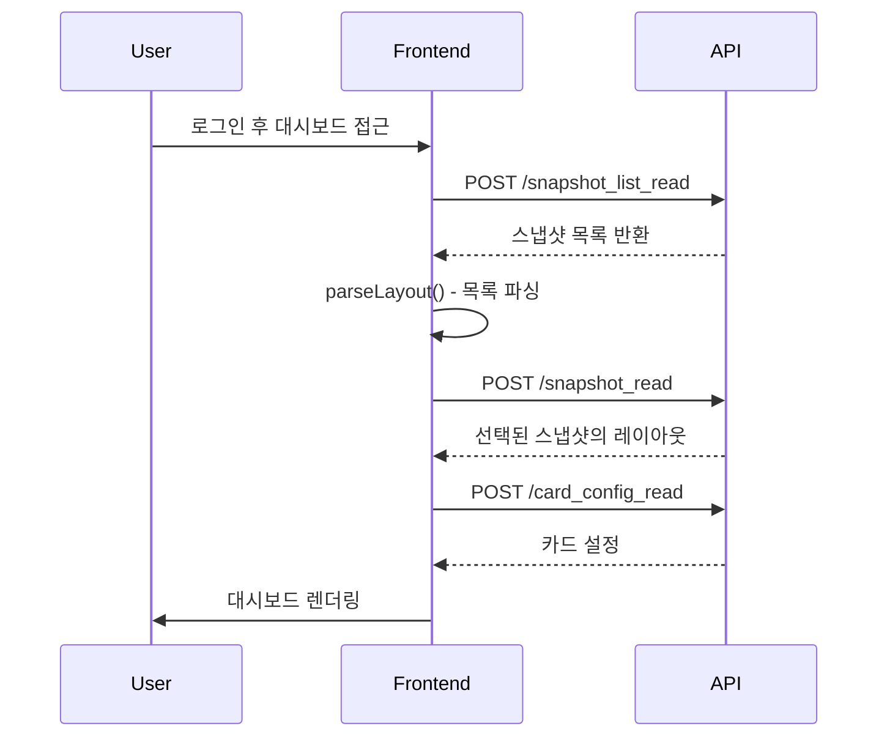
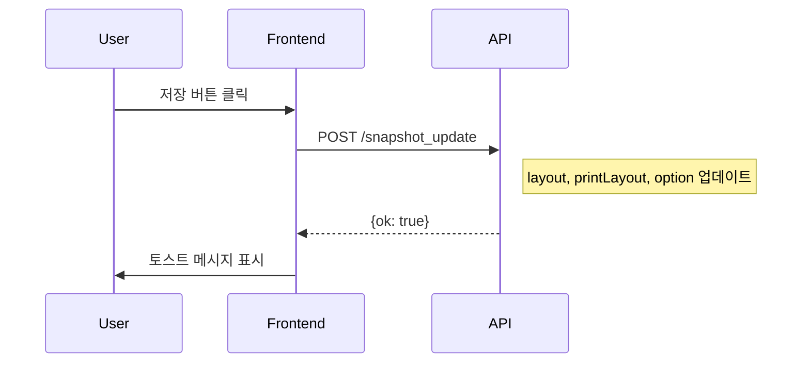
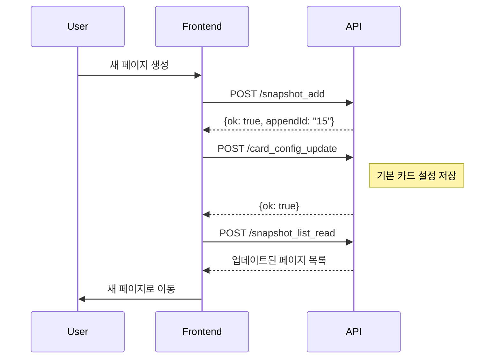

# 스냅샷 API 정리 (최신버전)

> 현재 프론트엔드 코드베이스(`dashboard v3.3`)에서 실제 사용 중인 스냅샷 관련 API 목록입니다.
> 
> 최종 업데이트: 2025-12-24

---

## 📋 목차

1. [스냅샷 CRUD API](#1-스냅샷-crud-api)
2. [카드 설정 API](#2-카드-설정-api)
3. [권한 관리 로직](#3-권한-관리-로직)
4. [기존 정리본과의 차이점](#4-기존-정리본과의-차이점)

---

## 1. 스냅샷 CRUD API

### 1.1 POST `/snapshot_add` - 새 스냅샷 생성

**목적**: 새로운 스냅샷(페이지)을 생성합니다.

**요청 파라미터**:
| 파라미터 | 타입 | 필수 | 설명 |
|---|---|---|---|
| `user_id` | String | ✅ | 사용자 ID |
| `company` | String | ✅ | 회사(고객) ID |
| `level` | Number | ✅ | 권한 레벨 (roleId) |
| `layout` | Object | ✅ | 스테이지 카드 레이아웃 데이터 |
| `printLayout` | Object | ✅ | 프린트용 카드 레이아웃 데이터 |
| `option` | Object | ✅ | 페이지 옵션 (title, isDarkMode, isPreview, seeEarth 등) |

**응답**:
```javascript
{
  ok: true,
  appendId: "12" // 새로 생성된 스냅샷 ID
}
```

**사용 위치**:
- `src/hook/usePage.jsx` - `appendPage()`, `appendNewPage()`
- `src/hook/useMainSetting.jsx` - `appendPage()`, `appendNewPage()`

**사용 예시**:

```javascript
// 현재 페이지 복사하여 새 페이지 생성
const appendPage = async (pageobj) => {
    const {level, title} = pageobj;
    const {id, roleId, custId} = userInfo;

    let bodyObj = {
        user_id: id,
        company: custId,
        level: level,
        layout: currentCards,
        printLayout: currentPrintCards,
        option: {
            title: title,
            isDarkMode: true,
            isPreview: false,
            seeEarth: false
        }
    };

    const result = await onPostWithToken(
        `${dashobardDBUrl}/snapshot_add`, 
        null, 
        bodyObj
    );
    
    if(result && result.ok) {
        const newId = result?.appendId;
        getLayouts(newId); // 새 페이지로 이동
    }
}
```

---

### 1.2 POST `/snapshot_list_read` - 스냅샷 리스트 조회

**목적**: 사용자가 접근 가능한 스냅샷 목록을 조회합니다.

**요청 파라미터**:
| 파라미터 | 타입 | 필수 | 설명 |
|---|---|---|---|
| `user_id` | String | ✅ | 사용자 ID |
| `company` | String | ✅ | 회사(고객) ID |
| `level` | Number | ✅ | 권한 레벨 (roleId) |
| `onlyDel` | Boolean | ❌ | true면 삭제된 것만 조회 (휴지통) |

**응답**:
```javascript
{
  ok: true,
  snapshot: [
    {
      id: 12,
      order_num: 1,
      level: 3,
      layout: "{...}",
      option: "{\"title\":\"보안실태\",\"isDarkMode\":true,...}"
    },
    // ...
  ]
}
```

**사용 위치**:
- `src/hook/usePage.jsx` - `getSnapshot4Server()`
- `src/hook/useMainSetting.jsx` - `getSnapshot4Server()`
- `src/component/compobox.jsx` - `getDelList()` (삭제된 목록 조회)

**사용 예시**:

```javascript
// 일반 스냅샷 목록 조회
const getSnapshot4Server = async () => {
    const {id, roleId, custId} = userInfo;
    const bodyObj = {
        user_id: id,
        company: custId,
        level: roleId
    };

    const result = await onPostWithToken(
        `${dashobardDBUrl}/snapshot_list_read`, 
        null, 
        bodyObj
    );
    
    return result.snapshot;
}

// 삭제된 스냅샷 목록 조회 (휴지통)
const getDelList = async () => {
    const result = await onPost(
        `${dashobardDBUrl}/snapshot_list_read`, 
        {onlyDel: true, level: userInfo.roleId}
    );

    if(result.ok === true) {
        setDelList(result.snapshot);
    }
}
```

---

### 1.3 POST `/snapshot_read` - 개별 스냅샷 조회

**목적**: 특정 스냅샷의 레이아웃 데이터를 조회합니다.

**요청 파라미터**:
| 파라미터 | 타입 | 필수 | 설명 |
|---|---|---|---|
| `snapshot_id` | String | ✅ | 조회할 스냅샷 ID |
| `user_id` | String | ✅ | 사용자 ID |
| `company` | String | ✅ | 회사(고객) ID |
| `level` | Number | ✅ | 권한 레벨 (roleId) |
| `option` | Object | ✅ | 현재 페이지 옵션 |

**응답**:
```javascript
{
  ok: true,
  snapshot: "{\"List3\":{...},\"List4\":{...},...}" // JSON 문자열
}
```

**사용 위치**:
- `src/hook/useLayoutData.jsx` - `loadSnapshot()`

**사용 예시**:

```javascript
const loadSnapshot = async () => {
    if(!userInfo || !pageId) return;

    const {id, roleId, custId} = userInfo;
    const pageOption = pages[pageId];
    
    const bodyObj = {
        snapshot_id: pageId,
        option: pageOption,
        user_id: id,
        company: custId,
        level: roleId
    };

    const result = await onPost(
        `${dashobardDBUrl}/snapshot_read`, 
        bodyObj
    );

    if(!result?.snapshot) {
        return toast({
            description: "불러오기 실패하였습니다.",
            status: 'error'
        });
    }

    const snapshot = JSON.parse(result.snapshot);
    setStageCards(snapshot); // 레이아웃 적용
    
    return snapshot;
}
```

---

### 1.4 POST `/snapshot_update` - 스냅샷 업데이트

**목적**: 스냅샷의 레이아웃과 옵션을 업데이트합니다.

**요청 파라미터**:
| 파라미터 | 타입 | 필수 | 설명 |
|---|---|---|---|
| `snapshot_id` | String | ✅ | 업데이트할 스냅샷 ID |
| `layout` | Object | ✅ | 스테이지 카드 레이아웃 데이터 |
| `printLayout` | Object | ✅ | 프린트용 카드 레이아웃 데이터 |
| `option` | Object | ✅ | 페이지 옵션 |
| `user_id` | String | ✅ | 사용자 ID |
| `company` | String | ✅ | 회사(고객) ID |
| `level` | Number | ✅ | 권한 레벨 (roleId) |

**응답**:
```javascript
{
  ok: true
}
```

**사용 위치**:
- `src/hook/useLayoutData.jsx` - `saveSnapshot()`

**사용 예시**:

```javascript
const saveSnapshot = async () => {
    if(!userInfo || !pageId) return;
    
    const {id, roleId, custId} = userInfo;
    const page = pages[pageId] || {};

    const bodyObj = {
        snapshot_id: pageId,
        layout: stageCards,      // 현재 스테이지의 카드 레이아웃
        printLayout: printCards,  // 프린트용 레이아웃
        option: page,             // 페이지 옵션
        user_id: id,
        company: custId,
        level: roleId
    };

    const res = await onPost(
        `${dashobardDBUrl}/snapshot_update`, 
        bodyObj
    );
    
    if(res?.ok) {
        toast({
            description: "저장을 성공하였습니다.",
            status: 'loading'
        });
    } else {
        toast({
            description: "저장을 실패하였습니다.",
            status: 'error'
        });
    }
}
```

---

### 1.5 POST `/snapshot_update4Option` - 옵션만 업데이트

**목적**: 레이아웃은 그대로 두고 페이지 옵션만 업데이트합니다.

**요청 파라미터**:
| 파라미터 | 타입 | 필수 | 설명 |
|---|---|---|---|
| `snapshot_id` | String | ✅ | 업데이트할 스냅샷 ID |
| `level` | Number | ❌ | 권한 레벨 (페이지 수정 시) |
| `option` | Object | ✅ | 업데이트할 페이지 옵션 |

**응답**:
```javascript
{
  ok: true
}
```

**사용 위치**:
- `src/hook/usePage.jsx` - `updatePage()`, `changePageOption()`
- `src/hook/useMainSetting.jsx` - `updatePage()`, `changePageOption()`

**사용 예시**:

```javascript
// 페이지 메타정보 업데이트 (제목, 레벨 등)
const updatePage = async (pageobj, pageInfo) => {
    const {level, title} = pageobj;
    const {id} = pageInfo;
    
    const newPage = {
        ...pageInfo,
        title: title,
        level: level
    };

    let bodyObj = {
        snapshot_id: id,
        level: level,
        option: newPage
    };

    const result = await onPostWithToken(
        `${dashobardDBUrl}/snapshot_update4Option`, 
        null, 
        bodyObj
    );
    
    refreshCurrentPage(); // 페이지 새로고침
}

// 페이지 옵션 변경 (다크모드, Earth 표시 등)
const changePageOption = async (obj) => {
    const newPage = {
        ...currentPage,
        ...obj  // isDarkMode, seeEarth, isPreview 등
    };

    let bodyObj = {
        snapshot_id: currentPageId,
        option: newPage
    };

    const result = await onPostWithToken(
        `${dashobardDBUrl}/snapshot_update4Option`, 
        null, 
        bodyObj
    );
    
    refreshCurrentPage();
}
```

---

### 1.6 POST `/snapshot_remove` - 스냅샷 삭제 (Soft Delete)

**목적**: 스냅샷을 휴지통으로 이동합니다 (복원 가능).

**요청 파라미터**:
| 파라미터 | 타입 | 필수 | 설명 |
|---|---|---|---|
| `snapshot_id` | String | ✅ | 삭제할 스냅샷 ID |
| `company` | String | ✅ | 회사(고객) ID |

**응답**:
```javascript
{
  ok: true
}
```

**사용 위치**:
- `src/hook/usePage.jsx` - `deletePage()`
- `src/hook/useMainSetting.jsx` - `deletePage()`

**사용 예시**:

```javascript
const deletePage = async (pageid) => {
    const newPages = {...pages};
    const {id, roleId, custId} = userInfo;
    
    delete newPages[pageid];

    // 현재 페이지를 삭제하는 경우 다른 페이지로 이동
    if (currentPageId === pageid) {
        const keyArray = Object.keys(pages);
        setCurrentPageId(keyArray[0]);
    }

    let bodyObj = {
        snapshot_id: pageid,
        company: custId
    };

    const result = await onPostWithToken(
        `${dashobardDBUrl}/snapshot_remove`, 
        null, 
        bodyObj
    );
    
    if(result && result.ok) {
        getLayouts(); // 페이지 목록 새로고침
    }
}
```

---

### 1.7 POST `/snapshot_order` - 순서 변경

**목적**: 스냅샷의 표시 순서를 변경합니다.

**요청 파라미터**:
| 파라미터 | 타입 | 필수 | 설명 |
|---|---|---|---|
| `user_id` | String | ✅ | 사용자 ID |
| `company` | String | ✅ | 회사(고객) ID |
| `level` | Number | ✅ | 권한 레벨 (roleId) |
| `pages` | Array | ✅ | `[{id, order}, ...]` 형식의 배열 |

**응답**:
```javascript
{
  ok: true
}
```

**사용 위치**:
- `src/hook/usePage.jsx` - `orderPage()`
- `src/hook/useMainSetting.jsx` - `orderPage()`

**사용 예시**:

```javascript
const orderPage = async (arr) => {
    if(!userInfo) return;
    
    const {id, roleId, custId} = userInfo;
    
    const bodyObj = {
        user_id: id,
        company: custId,
        level: roleId,
        pages: arr  // [{id: "12", order: 1}, {id: "15", order: 2}, ...]
    };

    const result = await onPostWithToken(
        `${dashobardDBUrl}/snapshot_order`, 
        null, 
        bodyObj
    );
    
    console.log(result);
}
```

---

### 1.8 POST `/snapshot_restore` - 스냅샷 복원

**목적**: 휴지통의 스냅샷을 복원합니다.

**요청 파라미터**:
| 파라미터 | 타입 | 필수 | 설명 |
|---|---|---|---|
| `snapshot_id` | String | ✅ | 복원할 스냅샷 ID |
| `level` | Number | ✅ | 권한 레벨 (roleId) |

**응답**:
```javascript
{
  ok: true
}
```

**사용 위치**:
- `src/component/compobox.jsx` - `handlerRestore()`

**사용 예시**:

```javascript
const handlerRestore = async (itemId) => {
    const result = await onPost(
        `${dashobardDBUrl}/snapshot_restore`, 
        {snapshot_id: itemId, level: userInfo.roleId}
    );
    
    if(result.ok === true) {
        getLayouts(itemId);  // 복원된 페이지로 이동
        refresh();           // UI 새로고침
        getDelList();        // 휴지통 목록 갱신
    }
}
```

---

## 2. 카드 설정 API

### 2.1 POST `/card_config_read` - 카드 설정 조회

**목적**: 특정 스냅샷의 카드별 패딩/변환 설정을 조회합니다.

**요청 파라미터**:
| 파라미터 | 타입 | 필수 | 설명 |
|---|---|---|---|
| `snapshot_id` | String | ✅ | 스냅샷 ID |

**응답**:
```javascript
{
  ok: true,
  row: {
    padding: "{\"Gauge\":{...},\"Table\":{...}}",   // JSON 문자열
    transform: "{\"Gauge\":{...},\"Table\":{...}}"  // JSON 문자열
  }
}
```

**사용 위치**:
- `src/hook/useCardConfig.jsx` - `Control4CardConfigRefresh()`

**사용 예시**:

```javascript
useEffect(() => {
    if(!currentPageId) return;
    
    onPost(`${dashobardDBUrl}/card_config_read`, {
        snapshot_id: currentPageId
    }).then(res => {
        if(res.ok) {
            const {padding, transform} = res.row;
            let paddingObj = {};
            let transformObj = {};
            
            if(padding) paddingObj = JSON.parse(padding);
            if(transform) transformObj = JSON.parse(transform);

            setGlobalPadding(paddingObj);
            setGlobalTransform(transformObj);
        } else {
            setGlobalPadding({});
            setGlobalTransform({});
        }
    });
}, [currentPageId]);
```

---

### 2.2 POST `/card_config_update` - 카드 설정 업데이트

**목적**: 카드별 패딩/변환 설정을 업데이트합니다.

**요청 파라미터**:
| 파라미터 | 타입 | 필수 | 설명 |
|---|---|---|---|
| `snapshot_id` | String | ✅ | 스냅샷 ID |
| `padding` | Object | ✅ | 카드 타입별 패딩 설정 |
| `transform` | Object | ✅ | 카드 타입별 위치/크기 변환 설정 |

**응답**:
```javascript
{
  ok: true
}
```

**사용 위치**:
- `src/hook/useCardConfig.jsx` - `updateToDb()`
- `src/hook/useMainSetting.jsx` - `appendPage()` (새 페이지 생성 시)

**사용 예시**:

```javascript
const updateToDb = (transforms, paddings, callback) => {
    let bodyObj = {
        snapshot_id: currentPage.id,
        padding: paddings || globalPadding,
        transform: transforms || globalTransform
    };

    onPost(`${dashobardDBUrl}/card_config_update`, bodyObj).then(res => {
        if(!res.ok) return console.log('error =====', res);
        callback && callback(res);
    });
}

// 패딩 예시 데이터:
// padding: {
//   "Gauge": { top: 10, right: 20, bottom: 10, left: 20 },
//   "Table": { top: 5, right: 10, bottom: 5, left: 10 }
// }

// 변환 예시 데이터:
// transform: {
//   "Gauge": { xPos: 0, yPos: 0, fontSize: 14 },
//   "ArcGauge": { xPos: 5, yPos: 5, fontSize: 16, radiusSize: 100 }
// }
```

---

## 3. 권한 관리 로직

### 3.1 권한 레벨 (roleId)

현재 코드베이스에서 확인된 권한 체크 로직:

```javascript
const isSuper = roleId <= 3;  // 관리자 여부 판단
```

- **관리자**: `roleId <= 3`
- **일반사용자**: `roleId > 3`

### 3.2 API별 권한 동작 (추정)

기존 정리본에 따르면 다음과 같은 권한 로직이 서버에 구현되어 있을 것으로 추정됩니다:

| API | 관리자 (roleId ≤ 3) | 일반사용자 (roleId > 3) |
|---|---|---|
| `snapshot_list_read` | 부모 스냅샷만 조회 | 부모 스냅샷만 조회 |
| `snapshot_read` | 부모 직접 조회 | 복사본 우선 → 없으면 부모 |
| `snapshot_add` | 부모 생성 | 부모 생성 |
| `snapshot_update` | 부모 직접 수정 | 복사본 생성/수정 (Copy-on-Write) |
| `snapshot_update4Option` | 부모 직접 수정 | 복사본 생성/수정 (Copy-on-Write) |
| `snapshot_remove` | 부모 삭제 | 복사본만 삭제 |
| `snapshot_order` | 부모 순서 변경 | 부모 순서 변경 |

### 3.3 Copy-on-Write 패턴

일반사용자가 스냅샷을 수정할 때 원본을 보호하기 위한 패턴:

```
부모 스냅샷 (id=1, parent_id=NULL, snapshot_id='snap_abc')
    ↓ 일반사용자가 수정 시
복사본 생성 (id=100, parent_id=1, snapshot_id='snap_xyz', user_id=현재사용자)
```

**조회 우선순위**:
1. 자신의 복사본 (`parent_id=X, user_id=본인`)
2. 부모 스냅샷 (`parent_id=NULL, id=X`)

> **주의**: 현재 프론트엔드 코드에서는 `parent_id`나 Copy-on-Write 로직이 명시적으로 보이지 않습니다. 
> 이는 서버 측에서 처리되는 로직일 가능성이 높습니다.

---

## 4. 기존 정리본과의 차이점

### 4.1 현재 코드베이스에서 **발견되지 않은** API

다음 API들은 기존 정리본에 언급되었으나, 현재 프론트엔드 코드에서 사용하지 않습니다:

| API | 상태 | 비고 |
|---|---|---|
| `/snapshot` | ❌ 미사용 | 구버전 API, `json` 필드 사용 |
| `/snapshot_allremove` | ❌ 미사용 | 위험한 Hard Delete API |
| `/snapshot_format_update` | ❌ 미사용 | 일회성 마이그레이션 API |
| `/migrate-add-parent-id` | ❌ 미사용 | DB 마이그레이션 API |

**권장사항**: 
- 이 API들이 서버에 여전히 존재한다면, 보안상 제거하거나 접근을 제한하는 것이 좋습니다.
- 특히 `/snapshot_allremove`는 복구 불가능한 삭제를 수행하므로 프로덕션 환경에서 제거해야 합니다.

### 4.2 새롭게 발견된 API

다음 API들은 기존 정리본에 없었으나, 현재 코드베이스에서 사용 중입니다:

| API | 용도 | 호출 위치 |
|---|---|---|
| `/card_config_read` | 카드별 패딩/변환 설정 조회 | `useCardConfig.jsx` |
| `/card_config_update` | 카드별 패딩/변환 설정 업데이트 | `useCardConfig.jsx`, `useMainSetting.jsx` |

**기능 설명**:
- 각 카드 타입(Gauge, Table, List 등)별로 패딩과 위치/크기 변환 값을 저장
- 스냅샷마다 개별적으로 설정 가능
- 글로벌 설정으로 모든 해당 타입 카드에 일괄 적용

### 4.3 파라미터 차이점

기존 정리본과 비교하여 실제 사용되는 파라미터:

**`snapshot_add`**:
- 기존: `isPdfMode` 파라미터 언급
- 현재: `isPdfMode` 사용되지 않음, `printLayout` 파라미터 사용

**`snapshot_list_read`**:
- 기존: `isSkt`, `isPdfMode`, `roleId` 파라미터 언급
- 현재: `onlyDel`만 선택적으로 사용 (휴지통 조회용)

**`snapshot_read`**:
- 기존: `isPdfMode`, `roleId` 파라미터 언급
- 현재: 해당 파라미터들 사용되지 않음

**`snapshot_update4Option`**:
- 기존: `user_id`, `isPdfMode`, `roleId` 파라미터 언급
- 현재: `snapshot_id`, `level`, `option`만 사용

### 4.4 인증 방식

**현재 사용 중인 함수**:
- `onPostWithToken()`: 토큰 기반 인증 (대부분의 API)
- `onPost()`: 일반 POST 요청 (일부 API)

```javascript
// src/pages/utils.jsx에 정의되어 있을 것으로 추정
await onPostWithToken(`${dashobardDBUrl}/snapshot_add`, null, bodyObj);
await onPost(`${dashobardDBUrl}/snapshot_read`, bodyObj);
```

---

## 5. 데이터 구조

### 5.1 스냅샷 레이아웃 구조

```javascript
{
  "List3": {
    "cardLocation": {
      "w": 59, "h": 27, "x": 51, "y": 87,
      "i": "List3",
      "moved": true,
      "static": false,
      "isDraggable": true
    },
    "cardType": "List",
    "cardTitle": "최근 위협 탐지 내역",
    "cardId": "List3",
    "isCardHeader": true,
    "zIndex": 2103,
    "value": null,
    "options": {
      "dataPath": "http://example.com/api/data",
      "color": true,
      "seeFilter": false
    },
    "children": [],
    "isFixed": false
  },
  // ... 다른 카드들
}
```

### 5.2 페이지 옵션 구조

```javascript
{
  "id": "12",
  "title": "보안실태",
  "level": 3,
  "order": 1,
  "isDarkMode": true,
  "isPreview": false,
  "seeEarth": false,
  "theme": "dark",  // 선택적
  "interval": 60    // 선택적, 자동 새로고침 간격
}
```

### 5.3 카드 설정 구조

```javascript
// padding
{
  "Gauge": {"top": 10, "right": 20, "bottom": 10, "left": 20},
  "Table": {"top": 5, "right": 10, "bottom": 5, "left": 10},
  "List": {"top": 8, "right": 15, "bottom": 8, "left": 15}
}

// transform
{
  "Gauge": {"xPos": 0, "yPos": 0, "fontSize": 14},
  "ArcGauge": {"xPos": 5, "yPos": 5, "fontSize": 16, "radiusSize": 100},
  "StatusGauge": {"xPos": 0, "yPos": 0, "fontSize": 12, "radiusSize": 80}
}
```

---

## 6. API 호출 흐름

### 6.1 페이지 로딩 시



### 6.2 스냅샷 저장 시



### 6.3 새 페이지 생성 시



---

## 7. 에러 처리

### 7.1 공통 에러 처리 패턴

```javascript
// 기본 에러 처리
const result = await onPostWithToken(url, null, bodyObj);
if(result && result.ok) {
    // 성공 처리
} else {
    // 실패 처리 (에러 토스트 등)
}

// Toast를 사용한 에러 알림
if(!result?.snapshot) {
    return toast({
        position: 'top',
        description: "불러오기 실패하였습니다.",
        status: 'error',
        duration: 3000,
        isClosable: true
    });
}
```

### 7.2 권한 에러

```javascript
const openAlert = (id, snapshots) => {
    if(!(snapshots && Array.isArray(snapshots))) {
        alert("페이지를 가져오지 못했습니다");
    } else if(id) {
        alert("접근 권한이 없습니다");
    } else if(!id) {
        alert("페이지 아이디 파라미터가 존재하지 않습니다");
    }
}
```

---

## 8. 참고사항

### 8.1 URL 설정

API 기본 URL은 `src/ref/url.jsx`에 정의되어 있을 것으로 추정됩니다:

```javascript
import {dashobardDBUrl, userDBUrl} from '../ref/url'

// 예상 구조:
// export const dashobardDBUrl = "http://example.com/api";
// export const userDBUrl = "http://example.com/user";
```

### 8.2 토큰 관리

```javascript
// 토큰 저장
saveLocalDataStr("token", newToken);

// 토큰 불러오기
const token = loadLocalDataStr("token");

// 토큰과 함께 API 호출
await onPostWithToken(url, token, bodyObj);
```

### 8.3 페이지 ID 관리

페이지 ID 우선순위:
1. 새로 생성된 페이지 ID (`newId`)
2. URL 파라미터의 ID (`?id=123`)
3. 로컬 스토리지의 마지막 페이지 ID
4. 첫 번째 스냅샷 ID
5. 없으면 권한 에러 또는 로그아웃

```javascript
let urlObj = new URL(window.location.href);
const snapshotId4Url = urlObj.searchParams.get("id");
const pageId = loadLocalDataStr("currentPageId");

if(newId && newSnapshots.hasOwnProperty(newId)) {
    setCurrentPageId(newId);
} else if(snapshotId4Url && newSnapshots.hasOwnProperty(snapshotId4Url)) {
    setCurrentPageId(snapshotId4Url);
} else if(pageId && newSnapshots.hasOwnProperty(pageId)) {
    setCurrentPageId(pageId);
} else if(snapshotArray.length > 0) {
    setCurrentPageId(snapshotArray[0].id);
} else {
    // 권한 없음 또는 페이지 없음
    setToken(null);
    setUser(null);
}
```

---

## 9. 요약

### 9.1 필수 API (8개)

1. ✅ `/snapshot_add` - 새 스냅샷 생성
2. ✅ `/snapshot_list_read` - 스냅샷 목록 조회
3. ✅ `/snapshot_read` - 개별 스냅샷 조회
4. ✅ `/snapshot_update` - 전체 업데이트
5. ✅ `/snapshot_update4Option` - 옵션만 업데이트
6. ✅ `/snapshot_remove` - 삭제 (Soft Delete)
7. ✅ `/snapshot_order` - 순서 변경
8. ✅ `/snapshot_restore` - 복원

### 9.2 부가 API (2개)

9. ✅ `/card_config_read` - 카드 설정 조회
10. ✅ `/card_config_update` - 카드 설정 업데이트

### 9.3 주요 특징

- **인증**: 토큰 기반 인증 (`onPostWithToken`)
- **권한**: `roleId` 기반 권한 관리 (≤3: 관리자, >3: 일반사용자)
- **삭제**: Soft Delete 방식 (복원 가능)
- **정렬**: 페이지 순서 커스터마이징 지원
- **레이아웃**: 일반 레이아웃 + 프린트 레이아웃 분리 관리
- **설정**: 카드별 패딩/변환 설정 지원

---

**문서 작성일**: 2025-12-24  
**코드베이스 버전**: dashboard v3.3  
**분석 범위**: `src/hook/`, `src/component/compobox.jsx`


